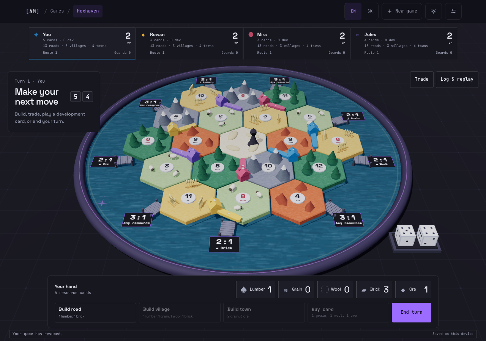
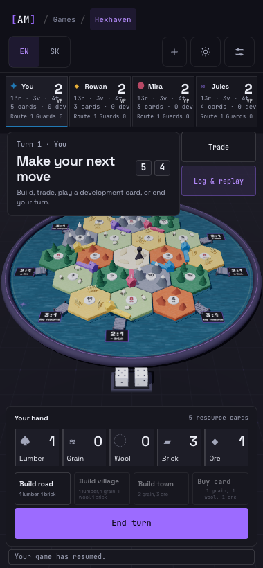
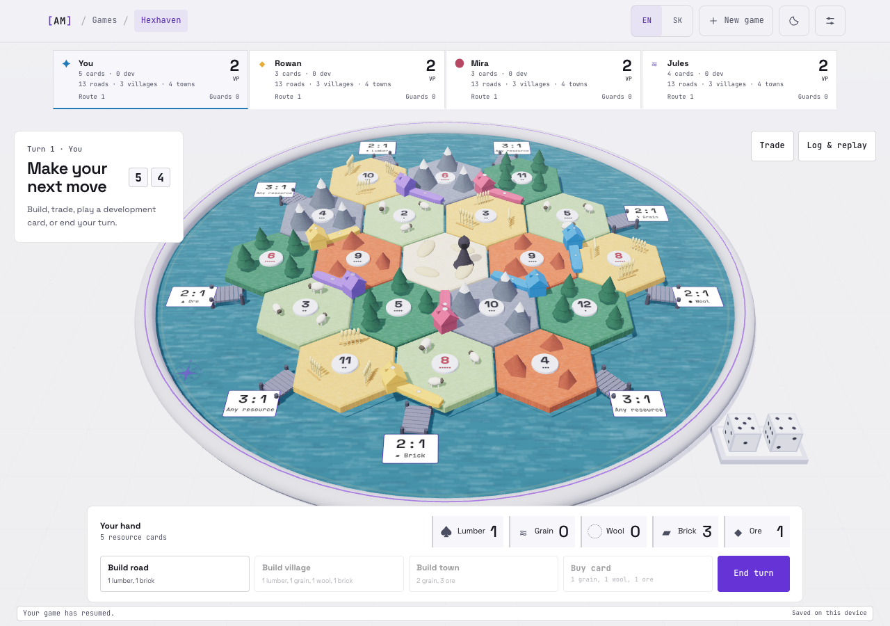
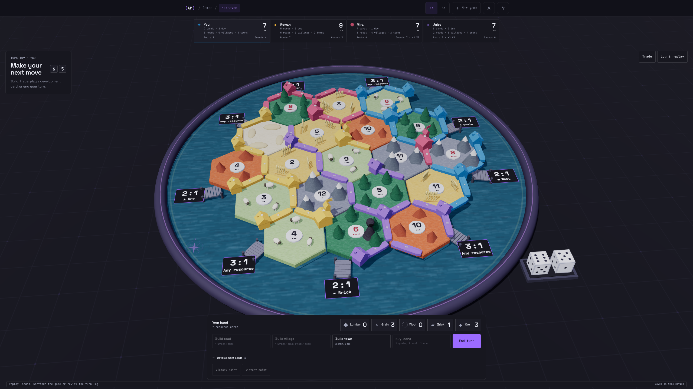

# Hexhaven — Traders of the Long Bay

An original implementation of public-domain game mechanics, not affiliated with
or endorsed by the rights holder of any commercial edition.

Build villages around a miniature island, trade its resources, and grow your
network to ten victory points. Play locally with two to four traders: pass the
device between humans or add bots at Easy, Normal or Hard difficulty. All 3D
geometry, board textures, symbols and sounds are generated in code. The game
shares the portfolio's colours, navigation style, Space Grotesk and JetBrains
Mono fonts. Font files are served locally with the standalone build.

Use **EN / SK** in the header, welcome dialog or settings to switch between
English and Slovak. Hexhaven shares the website's saved language preference;
`?lang=sk` opens it directly in Slovak. Switching translates the HUD, existing
turn log, board labels and accessibility instructions without changing the
game, camera or replay. The language remains selected after a refresh.



## Run and build

Use Node 24 and pnpm 9.9.0. From the repository root:

```sh
pnpm install --frozen-lockfile
pnpm dev:hexhaven
```

Open `http://127.0.0.1:4174/hexhaven/`. The portfolio's quiet **Games** footer link
also leads here through its shared game list.

```sh
pnpm typecheck
pnpm lint
pnpm test
pnpm build
pnpm sim --games=300 --seed=1
pnpm --filter hexhaven exec playwright install chromium
pnpm e2e
```

The build combines the portfolio, LEGO and Hexhaven in `build/`. Serve that
folder with a static web server; keep the `/hexhaven/` path. No API keys,
database, account or backend is required. Existing Netlify configuration runs
`pnpm build`. The build is ready to deploy; publishing is a separate operation.

## At the table

Choose a fixed beginner island or a reproducible random island and seed. Place
a village and an adjoining road, then repeat in reverse player order. Your
second village supplies its neighbouring resources. Every later turn begins
with a dice roll; a mature Guard card can also be played before rolling.

Matching, unblocked tiles supply one resource per village or two per town.
A seven makes each trader with more than seven cards return half, rounded down,
then the active trader relocates the Bandit and steals from an eligible neighbour.
After the roll, build and trade in any order before ending the turn.

| Build | Cost | Supply per trader |
| --- | --- | --- |
| Road | Lumber + brick | 15 |
| Village | Lumber + brick + wool + grain | 5 |
| Town | 2 grain + 3 ore; upgrades a village | 4 |
| Development card | Wool + grain + ore | Shared 25-card deck |

The build bar explains missing resources. A village needs an empty junction
with no neighbouring building and, after setup, one of your roads. Opposing
buildings interrupt road connections. Harbours automatically give your best
available bank ratio: 4:1, 3:1 or a resource-specific 2:1.

**Trade** contains bank exchanges and offers to one or all opponents. Adjust
both baskets, then propose the trade. Each recipient can accept, decline or
send one counteroffer. In hotseat, pass the device and reveal the next hand.

Development cards provide Guards, two free roads, two bank resources, a resource
Monopoly, or a private victory point. Bought cards wait until a later turn;
only one playable card is allowed per turn. The Guard Banner and Trade Route
Charter are each worth two points. Victory is checked on the winner's own turn,
and the final table shows buildings, titles and revealed card points.

## Controls and preferences

| Control | Effect |
| --- | --- |
| Drag / scroll or pinch | Orbit / zoom within the board's camera limits |
| Click or tap a legal marker | Select a location and show its preview |
| Click or tap it again, or use the confirm button | Place the selected piece |
| Tab / Shift+Tab while the board is focused | Cycle legal locations |
| Enter while the board is focused | Confirm selection |
| Esc | Cancel selection; leave board navigation for HUD controls |
| 1 / 2 / 3 | Arm Build road / Build village / Build town when legal |
| 4 | Buy a development card when legal |
| R | Roll dice when legal |

The previous/next location buttons provide the same path without keyboard
shortcuts. Normal Tab navigation reaches all HUD controls. Focus rings and a
live status region announce changes. The mobile HUD uses a bottom sheet;
player colours also have distinct piece glyphs. Settings provide animation
speed, an alternate colour-blind palette and synthesized sound, muted by
default. Reduced motion follows the operating-system preference.

The header's sun/moon control switches the shared light/dark theme. **Settings →
Website accent** selects the same six accents as the portfolio; both preferences
persist across visits. The HUD, grid surface, frame and harbour plaques follow
the selected appearance while terrain and player identities remain readable.





## Save, resume and replay

Every action queues a validated IndexedDB save on this device. Refresh resumes
the same game. **Log & replay** filters the history, highlights referenced board
locations on hover or focus, and lets you inspect an earlier action. **Return
to live** continues the current game. **Export replay** downloads a JSON file;
**Import replay** validates and reconstructs it from the seed and action list.
Storage failures appear in the status strip so an export can preserve progress.

Replays include setup options, the seed and all actions. They contain private
hands and future deck information, so they are a complete local game record.
In development builds only, `window.__hexhaven` exposes `state`, `dispatch`,
`legalActions` and `loadReplay`. Production removes this API.

## Architecture

- `src/core/`: readonly serializable state, canonical cube topology, board
  validation, legal actions, reducer, PRNG, trades, cards, scoring and replay.
  It imports no DOM, React or Three.js code.
- `src/bots/`: one shared evaluator with three difficulty weight sets. Policies
  return actions from `legalActions`, including discards and trade responses.
- `src/render/`: instanced procedural geometry and cached textures, one cube to
  world projection, pick proxies, camera, lighting and transition effects.
- `src/ui/`: DOM HUD and pure preference definitions. Buttons dispatch canonical
  actions supplied by the application; the HUD does not grant legality.
- `src/i18n/`: EN/SK presentation helpers, terminology and structured log
  translation. The headless engine and saved replay data do not depend on it.
- `src/app/`: reducer wiring, readable 400–900ms bot scheduling, IndexedDB,
  local settings, synthesized audio and the development API.
- `src/sim/`: deterministic headless tournament with per-action invariants.

The reducer rejects malformed or illegal actions with `RuleViolation`.
Random outcomes are drawn from the serialized PRNG state into canonical
roll/steal actions; replay validates the outcomes and reproduces exact state.
Longest-route search visits edges at most once, handles cycles and blocked
junctions, and memoizes graph searches. Separate oracle tests compare it with
brute force on 500 small random graphs.

## Verification

The workspace has 111 Hexhaven unit tests and 23 LEGO tests, plus portfolio and game-list rendering tests.
Coverage includes topology (19 tiles, 54 vertices, 72 edges), 100 random layouts,
all card effects and timing, distance/connectivity, blocked roads, piece limits,
shortfalls, discards, trade counters, route ties, replay and persistence guards.
Language tests verify unchanged replay/state and translation of played cards
after they leave the hand, names, resources, logs and actionable diagnostics.

The 300-game tournament from seed 1 completed 110,943 actions without a rule
violation. Every action conserved 19 cards of each resource; every game produced
one own-turn winner and ended before 400 turns.

| Statistic | Result |
| --- | --- |
| Turns: minimum / median / mean | 46 / 86 / 85.9 |
| Turns: p90 / p99 / maximum | 109 / 132 / 141 |
| Seat wins | 77 / 74 / 79 / 70 |
| Seat win rates | 25.7% / 24.7% / 26.3% / 23.3% |

Playwright drives real keyboard setup for both human villages and roads, checks
a 5 + 4 roll supplies two brick, refreshes to identical state, and downloads a
replay that reproduces that state. It also checks browser errors, mobile
horizontal overflow, draw-call and triangle budgets, and captures the images
above. A separate late-game test records rendering measurements at 2560×1440.
The seven browser tests also verify shared theme/accent persistence and both LEGO
header layouts across collection, building, languages and themes. The Slovak
flow checks switching during setup and play, persistent language with and without
query parameters, historic log translation and unchanged saved state on desktop
and mobile. [Slovak desktop](docs/screenshots/desktop-sk.png) and
[Slovak mobile](docs/screenshots/mobile-sk.png) captures show the result. CI runs
typecheck, lint, tests, build, the full tournament and browser checks.

## Rendering measurements

Measured on 8 September 2026 in headless Chrome 152, macOS arm64, Apple M1 Max,
ANGLE Metal, at 2560×1440 with device pixel ratio 1. The genuine turn-109 replay
contains 47 roads, 16 villages and five towns. The test drives the orbit camera
and counts actual rendered frames separately from browser animation callbacks.

| Measurement | Result | Budget |
| --- | --- | --- |
| Active rendered frames/s | 60.29 | 60 target |
| Active frame interval: median / p95 | 16.7 / 16.7 ms | — |
| Draw calls | 49 | ≤120 |
| Triangles | 19,093 | ≤150,000 |
| Active CPU scene/submission EWMA mean | 1.27 ms | — |
| Idle sea rendered frames/s | 19.85 | Intentionally throttled |
| Settled reduced-motion rendered frames | 0 over 912 ms | On demand |
| Complete game JavaScript, gzip, including Three.js | 175.01 kB | <700 kB excluding Three.js |

[Raw measurements](docs/screenshots/performance.json) include viewport, hardware,
browser, counters and timing methodology. CPU values exclude asynchronous GPU
execution. These numbers describe this host; lower-end integrated GPUs have not
been separately benchmarked. Shadows use a fitted 2048px map, instancing keeps
draw counts bounded, procedural textures are cached, and pixel ratio is capped
at 2. Active motion uses requestAnimationFrame; only the sea animates at idle,
and hidden tabs stop the render and bot schedules.



Rule interpretations and deviations are recorded in [DECISIONS.md](docs/DECISIONS.md).
Milestone plans and validation evidence are in [PLAN.md](docs/PLAN.md).
